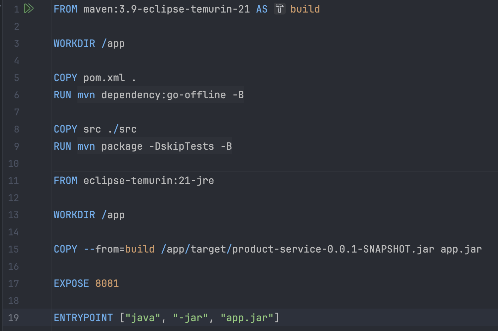
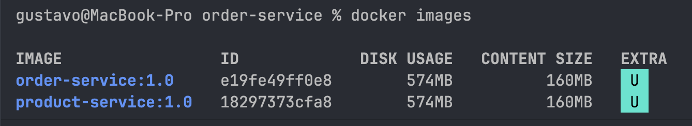
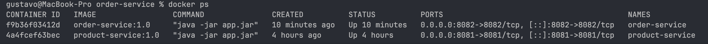
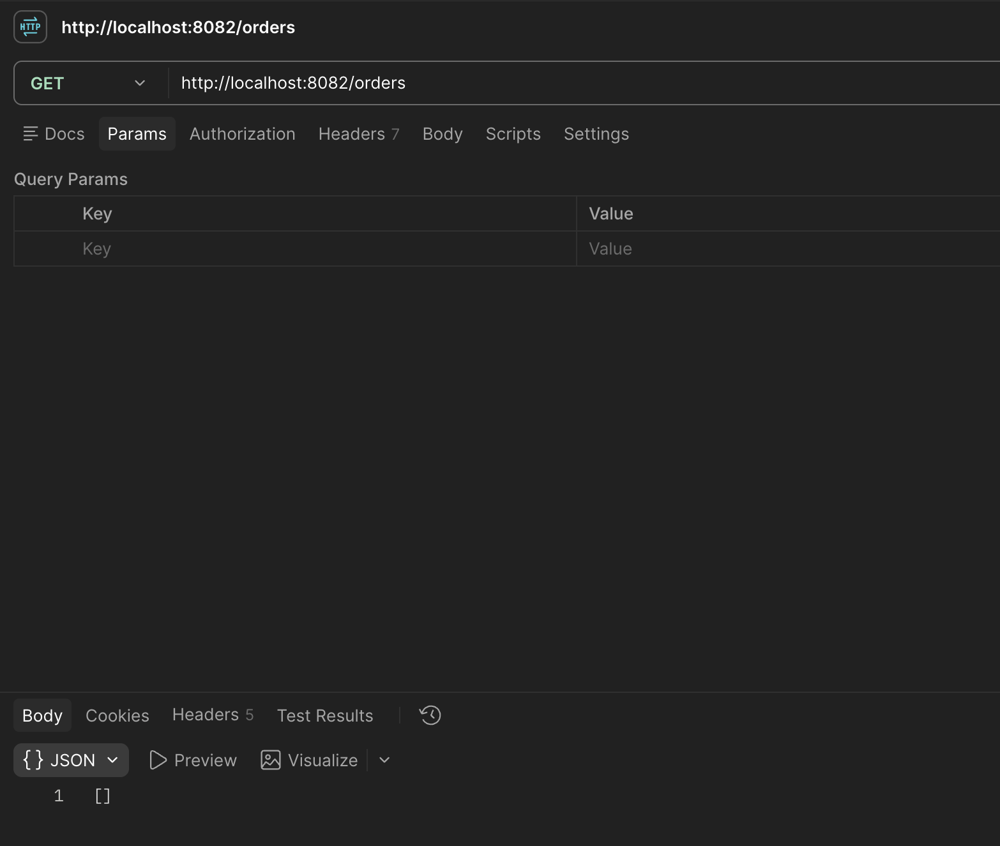
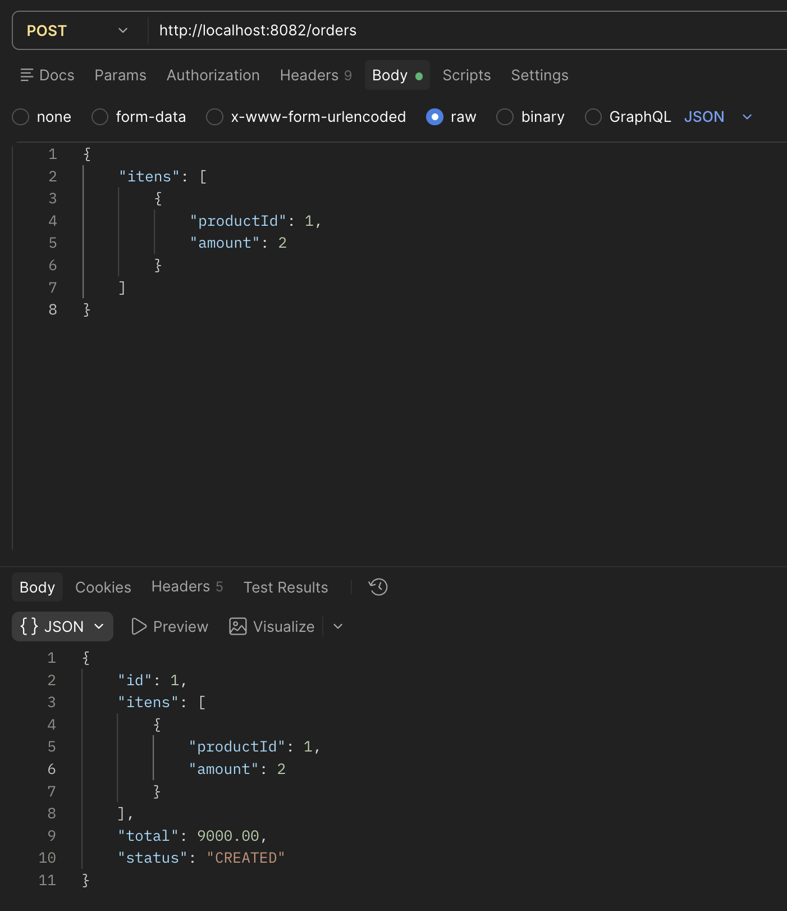
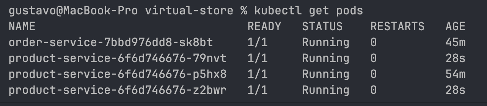

# Loja Virtual — Documentação do Trabalho Prático

> Documento de acompanhamento das etapas teóricas do trabalho "Do Docker ao Kubernetes".
> Atualizado progressivamente conforme cada etapa é aprovada.

---

## Etapa 1 — Planejamento da Aplicação

### Nome do projeto
Loja Virtual

### Objetivo
Aplicação baseada em microsserviços para simular o funcionamento básico de uma loja virtual, permitindo o cadastro e consulta de produtos, além da criação e consulta de pedidos vinculados a esses produtos. O projeto tem como foco demonstrar, de forma prática, a arquitetura de microsserviços persistentes (com banco de dados próprio por serviço), sua comunicação via HTTP, containerização com Docker, orquestração com Docker Compose e, por fim, migração e operação no Kubernetes — incluindo *service discovery* e balanceamento de carga nativos do orquestrador.

### Microsserviços e responsabilidades

#### 1. `product-service`
- **Responsabilidade:** gerenciar o catálogo de produtos da loja (cadastro e consulta).
- **Endpoints:**
  - `GET /products` — lista todos os produtos
  - `GET /products/{id}` — consulta um produto específico
  - `POST /products` — cadastra um novo produto
- **Entidade `Produto`:** id, nome, categoria, preço, descrição
- **Persistência:** banco de dados H2 próprio e independente (padrão *Database per Service*)

#### 2. `order-service`
- **Responsabilidade:** gerenciar os pedidos realizados, incluindo múltiplos produtos por pedido, com cálculo automático do valor total.
- **Endpoints:**
  - `GET /orders` — lista todos os pedidos
  - `GET /orders/{id}` — consulta um pedido específico
  - `POST /orders` — cria um novo pedido
- **Entidades:**
  - `Pedido`: id, itens (lista de `ItemPedido`), valorTotal, status
  - `ItemPedido`: produtoId, quantidade (composição interna de `Pedido`; sem referência direta à classe `Produto`, que pertence a outro serviço)
- **Persistência:** banco de dados H2 próprio e independente, separado do banco do `product-service`
- **Comunicação externa:** ao criar um pedido, consulta o `product-service` via HTTP para cada item, validando a existência do produto e obtendo seu preço para calcular o `valorTotal` automaticamente

### Decisões de arquitetura já definidas
- Cada microsserviço possui seu próprio banco de dados (H2), sem compartilhamento entre eles, respeitando a independência exigida pela arquitetura de microsserviços.
- A comunicação entre `order-service` e `product-service` ocorre exclusivamente via chamadas HTTP, nunca por acesso direto a dados ou classes do outro serviço.
- Não serão utilizadas ferramentas do ecossistema Spring Cloud (Eureka, Config Server, API Gateway dedicado). As funções que essas ferramentas cumpririam em uma arquitetura sem orquestrador serão supridas por mecanismos nativos do Kubernetes na fase final do projeto:
  - Service Discovery → `Service` do Kubernetes + DNS interno do cluster
  - Configuração externalizada → `ConfigMap` do Kubernetes
  - Roteamento de entrada → `Ingress` do Kubernetes (cobre parcialmente o papel de um API Gateway)

---

## Etapa 2 — Máquina Virtual × Container

**a) Como seria executar essa aplicação utilizando uma máquina virtual?**

Seria necessário provisionar uma máquina virtual com um sistema operacional completo instalado (kernel, drivers e processos de sistema próprios), gerenciada por um hypervisor (como VMware, VirtualBox ou Hyper-V). Dentro dessa VM, seria preciso instalar o JDK e então executar o `.jar` do microsserviço. Como `product-service` e `order-service` devem ser independentes, essa estrutura precisaria ser duplicada — uma VM inteira, com seu próprio sistema operacional, para cada um dos dois microsserviços.

**b) Como seria executar utilizando containers?**

Um container não possui sistema operacional próprio: ele compartilha o kernel do sistema operacional do host (a máquina física, ou a VM, em que o Docker Engine está instalado) e executa a aplicação como um processo isolado, empacotado junto apenas com as dependências mínimas necessárias para funcionar (no caso, o JDK e o `.jar` do serviço). Para colocar a aplicação em execução, basta empacotar cada microsserviço em uma imagem Docker e iniciar um container a partir dela — processo que não exige boot de um sistema operacional, apenas a inicialização do processo da aplicação.

**c) Qual solução tende a consumir menos recursos?**

Containers consomem significativamente menos recursos que máquinas virtuais. Isso ocorre porque cada VM carrega o peso de um sistema operacional completo independentemente do tamanho da aplicação executada nela, enquanto o container carrega apenas o processo da aplicação e suas dependências diretas, compartilhando o kernel do host. Isso também se reflete no tempo de inicialização: uma VM leva segundos a minutos para concluir o boot de um sistema operacional, enquanto um container inicializa em poucos segundos, por não haver esse processo de boot.

**d) Por que containers são interessantes para uma arquitetura de microsserviços?**

Containers oferecem isolamento entre os microsserviços sem o custo de recursos de uma VM completa para cada um, viabilizando a execução de múltiplos serviços independentes na mesma máquina física. Além disso, garantem portabilidade, pois empacotam a aplicação com exatamente as dependências necessárias para sua execução, eliminando inconsistências entre ambientes. Também permitem escalabilidade independente entre os serviços — um microsserviço com maior demanda pode ser replicado (executado em múltiplas instâncias) sem necessidade de replicar os demais. Por fim, a rapidez de inicialização dos containers favorece a recuperação automática em caso de falhas, permitindo que um serviço seja reiniciado rapidamente sem impacto significativo na disponibilidade da aplicação.

### Tabela comparativa

| Característica | Máquina Virtual | Container |
|---|---|---|
| Sistema operacional | Possui sistema operacional próprio e completo (kernel, drivers e processos independentes) | Não possui sistema operacional próprio; compartilha o kernel do sistema operacional do host |
| Consumo de recursos | Alto — cada VM reserva memória e disco para o SO completo, além da aplicação | Baixo — utiliza apenas os recursos necessários para o processo da aplicação e suas dependências |
| Inicialização | Lenta (segundos a minutos), pois exige o boot completo de um sistema operacional | Rápida (segundos), pois apenas inicia um processo isolado, sem boot de SO |
| Isolamento | Isolamento total, no nível de hardware virtualizado (cada VM é totalmente independente) | Isolamento no nível de processo, através de mecanismos do kernel do host (mais leve, porém compartilha o mesmo kernel entre containers) |

---

## Etapa 6 — Entendendo os Componentes Docker

**Dockerfile**

O Dockerfile é o arquivo de texto que descreve, passo a passo, como uma imagem Docker deve ser construída. No projeto, cada microsserviço possui seu próprio Dockerfile (`product-service/Dockerfile` e `order-service/Dockerfile`), utilizando a estratégia de multi-stage build: um primeiro estágio (`FROM maven:3.9-eclipse-temurin-21 AS build`) compila o código-fonte Java e gera o `.jar`, e um segundo estágio (`FROM eclipse-temurin:21-jre`) copia apenas o `.jar` resultante para uma imagem final mais enxuta, sem as ferramentas de build.



**Image (Imagem)**

A imagem é o artefato somente leitura, gerado a partir do Dockerfile através do comando `docker build`, contendo tudo que a aplicação precisa para executar, como o JRE 21 e o `.jar` do microsserviço. No projeto, foram geradas duas imagens, `product-service:1.0` e `order-service:1.0`, através dos comandos:
```
docker build -t product-service:1.0 .
docker build -t order-service:1.0 .
```



**Container**

O container é uma instância em execução de uma imagem. A partir da imagem `product-service:1.0`, foi criado o container `product-service` com o comando `docker run -d -p 8081:8081 --name product-service product-service:1.0`; o mesmo processo foi repetido para o `order-service`, gerando o container `order-service` a partir da imagem `order-service:1.0`. Ambos os containers foram testados de forma independente via Postman, confirmando que os endpoints (`/products` e `/orders`) respondem normalmente mesmo sem qualquer IDE em execução.





**Docker Engine**

O Docker Engine é o software responsável por interpretar os comandos `docker build` e `docker run`, gerenciando efetivamente a criação de imagens e a execução dos containers sobre o sistema operacional host.

**Port Mapping**

O mapeamento de porta conecta uma porta do host a uma porta interna do container, permitindo o acesso externo à aplicação. No projeto, isso foi feito através da flag `-p` no `docker run`, com `-p 8081:8081` para o `product-service` e `-p 8082:8082` para o `order-service`, o primeiro número referindo-se à porta do host, e o segundo à porta em que a aplicação Spring Boot escuta dentro do container (definida no `application.properties` de cada serviço). A instrução `EXPOSE`, presente em ambos os Dockerfiles, apenas documenta essas portas, sem publicá-las de fato.

**Network**

A rede Docker é o mecanismo que permite que containers diferentes se enxerguem e se comuniquem entre si pelo nome, em vez de utilizarem endereços IP. Até o momento desta etapa, `product-service` e `order-service` foram executados como containers isolados, sem compartilhar uma rede, cada um testado individualmente. A criação de uma rede dedicada, permitindo a comunicação direta entre os dois containers, será implementada nas Etapas 7 e 8 deste trabalho.

**Qual é a diferença entre uma imagem e um container?**

A imagem é a definição estática e somente leitura de uma aplicação, o "molde" a partir do qual containers são criados, análogo a uma classe Java. O container é a instância em execução dessa imagem, um processo ativo, com estado próprio em memória, análogo a um objeto instanciado a partir de uma classe. Uma mesma imagem pode originar múltiplos containers simultaneamente, cada um com seu próprio ciclo de vida, execução e estado, mas todos compartilhando a mesma base definida pela imagem.

---

## Etapa 7 — Comunicação entre Microsserviços

O `order-service` passou a consultar o `product-service` via HTTP no momento da criação de um pedido, através de um componente dedicado, o `ProductClient`, implementado com o `RestClient` do Spring. Para cada item do pedido, o `order-service` faz uma requisição `GET /products/{id}` ao `product-service`, obtendo o preço do produto e validando sua existência antes de calcular o valor total do pedido. Caso o produto não exista, o `product-service` responde com `404`, e o `order-service` traduz isso em uma exceção de domínio própria, retornando um erro tratado ao cliente da API.

O endereço do `product-service` foi configurado externamente, através da propriedade `product-service.url` no `application.properties` do `order-service`, referenciando o nome do container `product-service`, em nenhum momento utilizando `localhost`. Os dois microsserviços continuaram executando em containers Docker separados durante essa etapa.

**Como os containers se encontraram**

Dentro de uma rede Docker definida pelo usuário, o Docker Engine executa um servidor DNS interno que resolve automaticamente o nome de cada container conectado a essa rede para o seu respectivo endereço IP interno. Ao configurar `product-service.url=http://product-service:8081` no `order-service`, esse nome passou a ser resolvido para o endereço do container `product-service` dentro da rede `virtual-store-net`, permitindo a comunicação HTTP entre os dois containers sem depender de IPs fixos ou de `localhost`. Essa resolução de nomes só está disponível em redes Docker definidas pelo usuário, criadas na Etapa 8, o que tornou as Etapas 7 e 8 dependentes uma da outra na prática.

---

## Etapa 8 — Docker Network

**Comando utilizado para criar a rede**
```
docker network create virtual-store-net
```

**Containers conectados à rede**

Os dois containers foram recriados conectados à rede recém-criada, através da flag `--network`:
```
docker run -d -p 8081:8081 --name product-service --network virtual-store-net product-service:1.0
docker run -d -p 8082:8082 --name order-service --network virtual-store-net order-service:1.0
```

**Evidência da comunicação**

Com os dois containers na mesma rede, um `POST /orders` no `order-service` foi capaz de consultar o `product-service` pelo nome do container, obter o preço do produto referenciado e calcular corretamente o valor total do pedido, confirmando a comunicação entre os dois containers através da rede `virtual-store-net`.



---

## Etapa 9 — Docker Compose

Até esta etapa, a execução dos dois microsserviços exigia uma sequência de comandos manuais: criação da rede (`docker network create`), build de cada imagem (`docker build`) e execução de cada container individualmente (`docker run`), sempre repetindo as mesmas flags de porta, nome e rede. O Docker Compose substituiu essa sequência por um único arquivo declarativo, `docker-compose.yml`, capaz de construir as imagens, criar a rede e subir os dois containers com um único comando.

```yaml
services:
  product-service:
    build: ./product-service
    container_name: product-service
    ports:
      - "8081:8081"
    networks:
      - virtual-store-net

  order-service:
    build: ./order-service
    container_name: order-service
    ports:
      - "8082:8082"
    networks:
      - virtual-store-net

networks:
  virtual-store-net:
    driver: bridge
```

O arquivo define dois serviços, `product-service` e `order-service`, cada um construído a partir do Dockerfile presente em sua respectiva pasta. Os nomes dos serviços foram mantidos idênticos aos nomes de container já utilizados nas etapas anteriores, garantindo que a propriedade `product-service.url=http://product-service:8081`, já configurada no `order-service`, continuasse funcionando sem alterações, já que o Compose torna cada serviço descobrível pela rede através do seu próprio nome. A rede `virtual-store-net` foi declarada explicitamente na seção `networks`, com o driver `bridge`, reproduzindo a mesma rede criada manualmente na Etapa 8, porém agora criada automaticamente pelo próprio Compose.

Seguindo o desafio proposto pelo enunciado, os containers e a rede criados manualmente nas Etapas 7 e 8 foram removidos, e a aplicação foi iniciada novamente utilizando exclusivamente o comando:
```
docker compose up -d
```
Com isso, os dois microsserviços subiram corretamente, e a comunicação entre eles (testada através da criação de um pedido referenciando um produto previamente cadastrado) funcionou normalmente, confirmando que o `docker-compose.yml` substitui integralmente os comandos manuais utilizados até então.

---

## Etapa 10 — Preparando a Migração para Kubernetes

### Tabela comparativa

| Docker | Kubernetes |
|---|---|
| Container | Pod |
| Network (`virtual-store-net`) | Service + DNS interno do cluster |
| Port Mapping (`-p 8081:8081`) | `containerPort` (no Pod) + `port`/`targetPort` (no Service) |
| Serviço da aplicação (`product-service`, `order-service`, cada um rodando como container) | Deployment (gerencia a execução dos Pods) + Service (expõe um endereço estável) |
| Múltiplos containers da mesma imagem | Deployment com múltiplas réplicas (múltiplos Pods a partir da mesma imagem) |

### Por que uma aplicação que funciona com Docker não precisa ser completamente reescrita para funcionar no Kubernetes?

O Kubernetes não substitui o Docker, ele orquestra containers construídos a partir das mesmas imagens Docker já existentes. As imagens `product-service:1.0` e `order-service:1.0`, geradas pelos Dockerfiles multi-stage já implementados, são exatamente as mesmas imagens que o Kubernetes vai executar dentro dos Pods, sem nenhuma alteração no código Java, no Dockerfile ou no processo de build. O que muda é apenas a camada de orquestração: em vez de comandos manuais (`docker run`) ou de um arquivo `docker-compose.yml`, a configuração de execução passa a ser declarada em manifestos YAML (Deployment e Service), utilizando conceitos que já têm equivalentes diretos no que foi construído com Docker, como mostra a tabela acima. A aplicação em si, dentro do container, continua rodando da mesma forma, sem saber ou se importar se está sendo executada via `docker run`, Docker Compose, ou Kubernetes.

---

## Etapa 13 — Descoberta de Serviço e Balanceamento

**a) Qual é a função do Service?**

O Service fornece um endereço de rede estável e com nome para acessar um conjunto de Pods, independente de quantos Pods existam ou de quando eles sejam recriados. Como visto nas Etapas 11 e 12, o Service não se conecta a um Pod específico, ele se conecta a qualquer Pod que possua a label declarada no seu `selector`, no caso, `app: product-service`. Isso significa que o `order-service` sempre consegue alcançar `http://product-service:8081`, não importa qual Pod físico esteja de fato respondendo por trás desse nome.

**b) Por que podemos ter vários Pods do mesmo microsserviço?**

Porque cada Pod, criado a partir da mesma imagem (`product-service:1.0`), é uma instância completa e independente da aplicação, sem estado compartilhado entre eles no projeto, já que o H2 de cada Pod é isolado, em memória, dentro do próprio Pod. Essa é a mesma lógica vista na Etapa 6, ao comparar imagem e container, assim como é possível criar múltiplos containers a partir de uma imagem, o Deployment pode criar múltiplos Pods a partir do mesmo `template`, todos capazes de atender requisições de forma equivalente e intercambiável.

**c) O que acontece se um dos Pods parar de funcionar?**

O Deployment compara constantemente o estado desejado (`replicas: N`) com o estado real, ou seja, quantos Pods existem de fato, rodando. Se um Pod cair ou for encerrado por qualquer motivo, o Deployment percebe que a contagem real ficou menor que a desejada e cria automaticamente um novo Pod para repor, sem intervenção manual, essa é a auto-recuperação discutida na comparação entre Docker e Kubernetes.

**d) Como o Service ajuda na distribuição das requisições?**

Quando existe mais de um Pod atendendo ao mesmo `selector`, o Service distribui as requisições recebidas entre todos os Pods disponíveis, em vez de sempre enviar para o mesmo. Isso é o balanceamento de carga nativo do Kubernetes, o cliente, no caso o `order-service`, faz a chamada para um único nome (`product-service`), sem nenhum conhecimento de quantos Pods existem por trás, e o Service cuida de rotear cada requisição para um Pod saudável, distribuindo a carga entre eles.

**YAML atualizado (`k8s/product-service-deployment.yaml`)**

```yaml
apiVersion: apps/v1
kind: Deployment
metadata:
  name: product-service
spec:
  replicas: 3
  selector:
    matchLabels:
      app: product-service
  template:
    metadata:
      labels:
        app: product-service
    spec:
      containers:
        - name: product-service
          image: product-service:1.0
          imagePullPolicy: IfNotPresent
          ports:
            - containerPort: 8081
```

**Evidência dos três Pods funcionando**



---

## Etapa 14 — Avaliação e Reflexão sobre o Projeto

**a) Qual foi a parte mais fácil e qual foi a parte mais difícil do trabalho? Explique.**

A parte mais fácil foi a configuração do Docker. Depois de entender os conceitos de imagem, container, Dockerfile e multi-stage build, a aplicação prática seguiu um padrão bastante repetitivo e prescritivo, criar o Dockerfile, buildar a imagem, rodar o container, testar. Mesmo a evolução para Docker Compose manteve essa sensação de fórmula conhecida, sem exigir muita tomada de decisão a cada novo passo.

A parte mais difícil, e que ainda exige mais amadurecimento, foi compreender o Kubernetes de verdade. Diferente do Docker, onde a relação entre imagem e container é direta e intuitiva, o Kubernetes introduz várias camadas de abstração (Pod, Deployment, Service, labels, selectors) que não têm uma correspondência óbvia com nada visto antes, e que dependem de entender como essas peças se conectam entre si, não apenas o que cada uma faz isoladamente. Isso é um conhecimento que vai continuar sendo desenvolvido com tempo e prática, não algo consolidado ao final deste trabalho.

**b) Qual foi o principal aprendizado que você teve sobre Docker, containers e Kubernetes?**

O principal aprendizado foi conseguir diferenciar claramente cada uma dessas peças, e entender como elas se conectam formando um todo. Isso incluiu compreender a diferença entre uma imagem e um container, entender o papel de uma rede Docker na comunicação entre containers isolados, e depois perceber que o Kubernetes reorganiza esses mesmos conceitos em outra camada (Pods no lugar de containers soltos, Services no lugar da rede Docker), sem exigir que a aplicação em si fosse reescrita. Entender essa continuidade, de que o Kubernetes orquestra as mesmas imagens já construídas com Docker, foi o que deu mais sentido a todo o processo de migração feito nas últimas etapas do trabalho.

**c) Nota de 0 a 10 para o desempenho no trabalho, com justificativa**

Nota: **8**

Justificativa: entrega completa das 14 etapas, com entendimento demonstrado ao longo de todo o processo, incluindo decisões de arquitetura questionadas e defendidas conscientemente (modelagem com Value Object, separação de responsabilidades entre client e domínio, escolha de mecanismos nativos do Kubernetes em vez de Spring Cloud). A nota não é maior devido à falta de um entendimento completo da sintaxe YAML do Kubernetes, que ainda depende de mais tempo e prática para ser dominada com autonomia.
